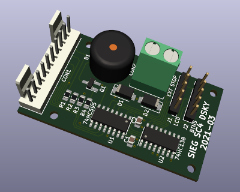
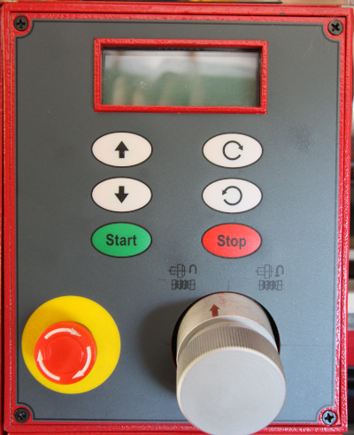
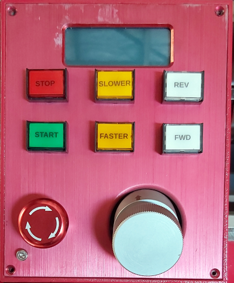

# SIEG SC4 Display and Keyboard (DSKY) Alternative

This is a replacement Printed Circuit Board (PCB) for the original Sieg SC4 lathe's
control panel. 

The intent is to replace the flat touch panel
buttons with regular illuminated push button switches that
are easier to use when the machine is in operation.

To do that, the original PCB must be removed as it gets in 
the way of the new panel switches. The LCD module on the
original PCB is retained by physically cutting it off 
with a utility knife and mounting it behind a new aluminium panel with a few
bolts and some J-B Weld epoxy.

The original panel looks like:

The new panel has illuminated push button switches arranged
in a more intuitive way:

The connections that were made between the switches on the old PCB
are now made directly between the new switches using hookup wire.

The new PCB is considerably smaller because it does not
have to accommodate the old tactile switches. It can be
connected to the both LCD and switches using ribbon cable.

